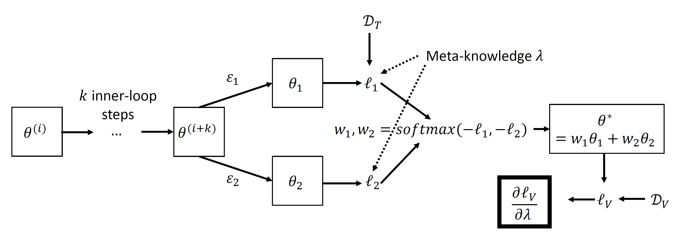

# EvoGrad: Efficient Gradient-Based Meta-Learning and Hyperparameter Optimization

<p align="center"></p>

[[Paper]](https://arxiv.org/abs/2106.10575)

## Summary
Gradient-based meta-learning and hyperparameter optimization have seen significant progress recently, enabling practical end-to-end training of neural networks together with many hyperparameters. Nevertheless, existing approaches are relatively expensive as they need to compute second-order derivatives and store a longer computational graph. This cost prevents scaling them to larger network architectures. We present EvoGrad, a new approach to meta-learning that draws upon evolutionary techniques to more efficiently compute hypergradients. EvoGrad estimates hypergradient with respect to hyperparameters without calculating second-order gradients, or storing a longer computational graph, leading to significant improvements in  efficiency. We evaluate EvoGrad on three substantial recent meta-learning applications, namely cross-domain few-shot learning with feature-wise transformations, noisy label learning with Meta-Weight-Net and low-resource cross-lingual learning with meta representation transformation. The results show that EvoGrad significantly improves efficiency and enables scaling meta-learning to bigger architectures such as from ResNet10 to ResNet34.

This repository provides implementation for the experiments mentioned in the paper:
* Illustration using a 1-dimensional problem
* Rotation transformation
* Cross-domain few-shot classification via learned feature-wise transformation
* Label noise with MetaWeightNet
* Low-resource cross-lingual learning with MetaXL

## Usage
The following libraries are generally needed for the experiments:
* PyTorch
* Higher
* Matplotlib
* Numpy
* Sklearn
* Tqdm

The versions and any additional libraries depend on the sub-problem (further details mentioned there).

## Citation

If you find this useful for your research, please consider citing:
 ```
 @inproceedings{bohdal2021evograd,
   title={EvoGrad: Efficient Gradient-Based Meta-Learning and Hyperparameter Optimization},
   author={Bohdal, Ondrej and Yang, Yongxin and Hospedales, Timothy},
   booktitle={Advances in Neural Information Processing Systems},
   year={2021}
}
 ```

## Acknowledgments

This work was supported in part by the EPSRC Centre for Doctoral Training in Data Science, funded by the UK Engineering and Physical Sciences Research Council (grant EP/L016427/1) and the University of Edinburgh.